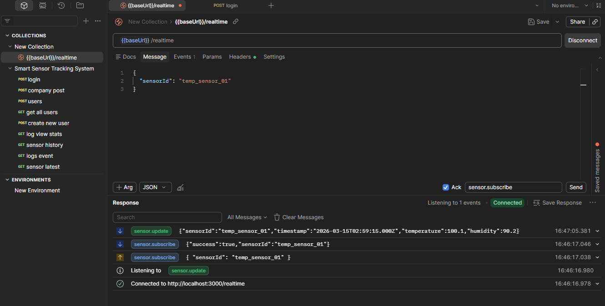
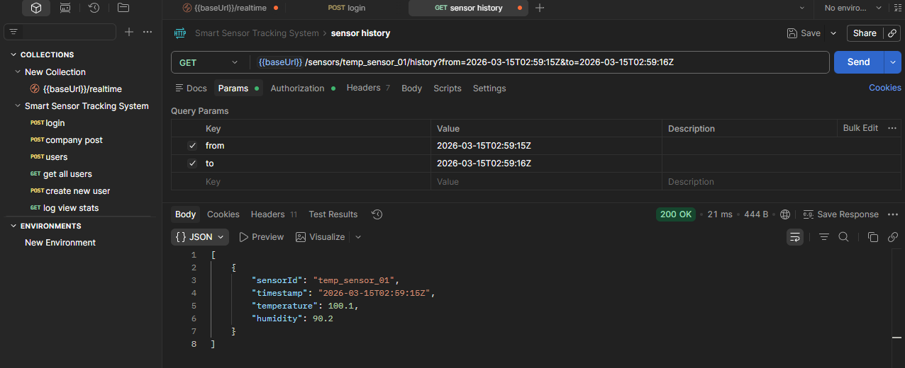
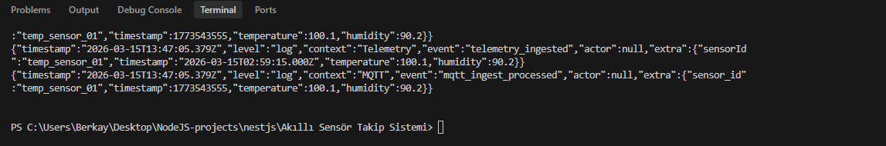

# Akilli Sensor Takip Sistemi (NestJS Modular Monolith)

Bu proje, fabrikadaki IoT sensorlerinden MQTT ile telemetry verisi toplayan, veriyi InfluxDB'ye yazan, istemcilere WebSocket ile gercek zamanli aktaran ve kullanici log goruntuleme davranisini takip eden bir backend servisidir.

## Genel Mimari

- `Company = Customer` modeli kullanilir. Ayrica bir `Customer` entity'si yoktur.
- Roller: `SYSTEM_ADMIN`, `COMPANY_ADMIN`, `USER`
- Kimlik dogrulama: `JWT only` (`Authorization: Bearer <token>`)
- MQTT backend tarafinda yalnizca ingest icin kullanilir.
- Client-facing gercek zamanli kanal `WebSocket`tir.

## Ozellikler

- IAM + RBAC
- MQTT ingest (subscribe -> validate -> persist)
- InfluxDB time-series kayitlari
- WebSocket realtime (`/realtime`) + sensor bazli oda aboneligi
- Structured JSON logging (`logs/app.jsonl`)
- Merkezi hata yonetimi (global exception filter)
- Kullanici log goruntuleme takibi (`POST /logs/views`)
- Event-only saatlik log istatistigi (`GET /logs/views/stats`)
- Global rate limiting
- Docker Compose ile PostgreSQL + InfluxDB + Mosquitto + App

## Dokumantasyon

- API endpoint dokumani: [docs/api-endpointleri.md](docs/api-endpointleri.md)
- Mimari tasarim dokumani: [docs/mimari-tasarim.md](docs/mimari-tasarim.md)
- Deployment rehberi: [docs/deployment-rehberi.md](docs/deployment-rehberi.md)

## Rol Kurallari

- `SYSTEM_ADMIN`: tum sirketler ve tum log/istatistik verileri.
- `COMPANY_ADMIN`: kendi sirket kullanicilari/cihazlari ve kendi sirket log istatistikleri.
- `USER`: sadece izinli sensor verilerini gorur.

## MQTT Veri Akisi

Input payload:

```json
{
  "sensor_id": "temp_sensor_01",
  "timestamp": 1710772800,
  "temperature": 25.4,
  "humidity": 55.2
}
```

Backend MQTT mesajlarini alir, dogrular ve InfluxDB'ye yazar; istemciye gercek zamanli yayin WebSocket ile yapilir.

### PowerShell + Mosquitto CLI ile MQTT publish (quote-safe)

PowerShell'de inline JSON gonderirken quote problemi yasamamak icin asagidaki yontem kullanilabilir:

```powershell
@'
{"sensor_id":"temp_sensor_01","timestamp":1773543555,"temperature":100.1,"humidity":90.2}
'@ | docker exec -i smart-sensor-mosquitto sh -lc "cat > /tmp/payload.json && mosquitto_pub -h localhost -p 8883 --cafile /mosquitto/certs/ca.crt -u '$env:MQTT_USERNAME' -P '$env:MQTT_PASSWORD' -t '$env:MQTT_INGEST_TOPIC' -f /tmp/payload.json"
```

Hizli dogrulama:

```powershell
docker logs --since 30s smart-sensor-app | Select-String "mqtt_ingest_processed|telemetry_ingested|mqtt_payload_invalid_json|mqtt_payload_validation_failed"
```

## Realtime (WebSocket Primary)

- Namespace: `/realtime`
- Baglanti: JWT handshake zorunlu
- Client eventleri:
  - `sensor.subscribe` `{ "sensorId": "..." }`
  - `sensor.unsubscribe` `{ "sensorId": "..." }`
- Server eventi:
  - `sensor.update` (yalnizca yetkili ve abone olunan sensor odasina)

Ornek akis:

1. `POST /auth/login` ile JWT al
2. Socket baglantisini JWT ile ac
3. `sensor.subscribe` ile yetkili sensor odasina katil
4. `sensor.update` eventlerini dinle

### Case Kaniti: Postman ile WebSocket Realtime Testi

Asagidaki ekran goruntuleri bonus maddede istenen "WebSocket uzerinden gelen verileri Postman ile test etme" akisinin calistigini gosterir:

1. Postman Socket.IO baglantisi `/realtime` namespace'ine acilir.
2. `sensor.subscribe` eventi `{"sensorId":"temp_sensor_01"}` payload'i ile gonderilir.
3. `sensor.subscribe` ack cevabinda `{"success":true,"sensorId":"temp_sensor_01"}` doner.
4. MQTT publish sonrasinda `sensor.update` eventi Postman'da gorulur.
5. `GET /sensors/:id/history` ile ayni olcumun REST tarafinda da kayda gectigi dogrulanir.
6. Terminal loglarinda `telemetry_ingested` ve `mqtt_ingest_processed` eventleri gorulur.







## API Ozeti

Detayli endpoint kontratlari ve request/response ornekleri icin `docs/api-endpointleri.md` dosyasini kullanin.

### Auth

- `POST /auth/login`

### IAM

- `GET /companies`
- `POST /companies`
- `GET /users`
- `POST /users`
- `PATCH /users/:id/role`
- `POST /users/:id/device-permissions`
- `GET /users/:id/device-permissions`

### Telemetry

- `POST /sensors`
- `GET /sensors/:id/latest`
- `GET /sensors/:id/history?from=...&to=...`

### Logs & Analytics

- `POST /logs/views`
- `GET /logs/views/stats?from=...&to=...&bucket=hour`
  - Erisim: `SYSTEM_ADMIN`, `COMPANY_ADMIN`
  - Not: Bu endpoint cagirildiginda otomatik `viewed_logs` kaydi olusur.
- `GET /logs/views/prediction`
  - Erisim: `SYSTEM_ADMIN`, `COMPANY_ADMIN`
  - Not: Son 24 saat log goruntuleme davranisindan bir sonraki saat icin basit tahmin doner ve endpoint cagrildiginda otomatik `viewed_logs` kaydi olusur.
- `GET /logs/events?from=...&to=...&level=log|warn|error&event=...&limit=...`
  - Erisim: sadece `SYSTEM_ADMIN`
  - Varsayilan `limit=100`, maksimum `limit=500`
  - Not: Bu endpoint cagirildiginda otomatik `viewed_logs` kaydi olusur.

## Hata Yanit Formati

Tum HTTP hatalari tek tip JSON formatinda doner:

```json
{
  "success": false,
  "statusCode": 400,
  "message": "Validation failed",
  "timestamp": "2026-03-14T12:00:00.000Z",
  "path": "/sensors/bad/latest",
  "method": "GET"
}
```

## Guvenlik

- JWT only
- MQTT TLS/SSL zorunludur (`MQTT_URL` mutlaka `mqtts://` olmalidir).
- Sertifika dogrulamasi zorunludur (`MQTT_TLS_REJECT_UNAUTHORIZED=true`).
- CA sertifika yolu zorunludur (`MQTT_TLS_CA_PATH`).
- MQTT private key dosyalari (`*.key`) repoya alinmaz; sadece local/development ortaminda uretilir.
- Docker Compose icinde secret literal tutulmaz; tum secretlar yalnizca `.env` dosyasindan okunur.
- Global rate limiting aktiftir.

## MQTT Konfig Notu

- Ingest topic icin yalnizca `MQTT_INGEST_TOPIC` kullanilir.

## Log Kayit Semasi

- Tum loglar JSONL formatinda su alanlarla saklanir: `timestamp`, `level`, `context`, `event`, `actor`, `extra`.

## Kurulum

Asagidaki env degiskenleri zorunludur: `JWT_SECRET`, `BOOTSTRAP_ADMIN_EMAIL`, `BOOTSTRAP_ADMIN_PASSWORD`, `POSTGRES_USER`, `POSTGRES_PASSWORD`, `POSTGRES_DB`, `DOCKER_INFLUXDB_INIT_MODE`, `DOCKER_INFLUXDB_INIT_USERNAME`, `DOCKER_INFLUXDB_INIT_PASSWORD`, `INFLUX_TOKEN`, `INFLUX_ORG`, `INFLUX_BUCKET`, `MQTT_USERNAME`, `MQTT_PASSWORD`, `MQTT_URL` (`mqtts://`), `MQTT_TLS_REJECT_UNAUTHORIZED` (`true`), `MQTT_TLS_CA_PATH`.

Opsiyonel:
- `RUN_DB_SEED=true` yapilirsa container acilisinda `prisma seed` otomatik calisir.

1. MQTT sertifikalarini localde uret:

```powershell
powershell -ExecutionPolicy Bypass -File .\scripts\generate-mqtt-certs.ps1
```

2. Ortam dosyasini olustur:

```powershell
Copy-Item .env.example .env
```

3. Docker ile sistemi kaldir:

```bash
docker compose up --build
```

Eksik zorunlu env varsa `docker compose config` komutu fail eder.
`RUN_DB_SEED=true` ise migration sonrasi seed verileri de otomatik uygulanir.

4. Docker disinda local calistirma (opsiyonel):

```bash
npm install
npm run prisma:generate
npm run prisma:migrate
npm run prisma:seed
npm run start:dev
```

## Test

```bash
npm test
npm run build
```

## Seed Data

Proje icin baslangic verisi `npm run prisma:seed` ile uretilir.

Seed su kayitlari olusturur/gunceller:

- Sirketler: `Acme Manufacturing`, `Beta Industries`
- Kullanicilar:
  - `SYSTEM_ADMIN`: `BOOTSTRAP_ADMIN_EMAIL` (`BOOTSTRAP_ADMIN_PASSWORD`)
  - `COMPANY_ADMIN`: `admin@acme.local` / `CompanyAdmin123!`
  - `USER`: `user@acme.local` / `User123!`
  - `COMPANY_ADMIN`: `admin@beta.local` / `CompanyAdmin123!`
- Sensorler: `temp_sensor_01`, `humid_sensor_01`, `temp_sensor_99`
- Ornek cihaz yetkileri ve log goruntuleme eventleri

## Swagger

- Swagger UI: `http://localhost:3000/docs`
- OpenAPI JSON: `http://localhost:3000/docs-json`
